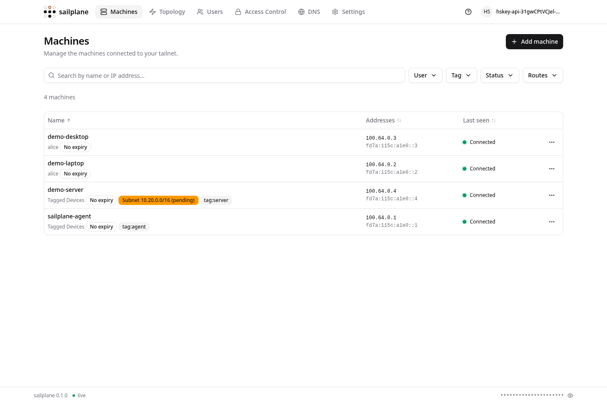

<picture>
  <source media="(prefers-color-scheme: dark)" srcset="docs/assets/logo-dark.svg">
  
</picture>

# Sailplane

<br clear="left">

Sailplane is a web UI for [Headscale](https://headscale.net). One binary serves
the single-page app, the JSON API and the live event stream. With every feature
enabled, the process stays under 50 MB RSS.

It is a from-scratch reimplementation of
[`tale/headplane`](https://github.com/tale/headplane) in Rust and Vue 3. The
configuration schema, the HTTP surface and the Headscale API contracts match.
The product names, environment variables and default paths do not; see the
[migration table](docs/CONFIGURATION.md#migrating-from-upstream-headplane).

<div align="center">
  
  <em>The machines page</em>
</div>

## Features

- **Machines** — search, filters and sorting; per-machine detail with routes,
  addresses and client connectivity; register, rename, expire, edit routes and
  tags, change owner, delete.
- **Users** — Headscale users and Sailplane accounts side by side; create,
  rename, delete, link, assign roles, transfer ownership.
- **Access control** — a structured editor for `acls`, `ssh`, `hosts`, `groups`
  and `tagOwners`, plus a HuJSON editor with a side-by-side diff. Unknown keys
  are preserved.
- **Access checker** — ask whether one machine may reach another on a port. The
  answer names the rule that decided it. Headscale enforces a policy; Sailplane
  explains one.
- **Topology** — the policy drawn as a graph, with the route hubs and relay
  regions of the tailnet.
- **DNS and DERP** — the DNS settings and the relay map, written back into the
  Headscale config file.
- **Audit log** — every state-changing request, with actor and result. The
  database keeps the most recent 5000 entries.
- **Auth** — Headscale API keys, OpenID Connect (PKCE, discovery, role claims)
  and trusted reverse-proxy authentication.
- **Live updates** — server-sent events push node and user changes to every open
  browser.
- **Browser SSH** — open a terminal to a tailnet node from the browser.
- **English and Simplified Chinese**, following the browser language.

## Installation

```sh
cd web && npm install && npm run build   # builds the SPA into web/dist
cargo build --release                    # embeds web/dist in the binary
./target/release/sailplane --config /etc/sailplane/config.yaml
```

See [docs/INSTALLATION.md](docs/INSTALLATION.md) for the full guide, the
reverse-proxy setup and a systemd unit. Container images are published to
`ghcr.io/jiuh-star/sailplane` for amd64 and arm64.

## Documentation

| Document | Contents |
| --- | --- |
| [INSTALLATION.md](docs/INSTALLATION.md) | Build, install, reverse proxy, TLS, containers |
| [CONFIGURATION.md](docs/CONFIGURATION.md) | Every configuration key, secrets, environment overrides, migration |
| [ARCHITECTURE.md](docs/ARCHITECTURE.md) | Design constraints, modules, the Go components, security position |
| [TROUBLESHOOTING.md](docs/TROUBLESHOOTING.md) | Known failure modes and fixes |
| [DEVELOPMENT.md](docs/DEVELOPMENT.md) | Build, test, demo, locales, comment style |
| [DEMO.md](docs/DEMO.md) | A self-contained demo with a throwaway Headscale |
| [UPSTREAM-CONTRACT.md](docs/UPSTREAM-CONTRACT.md) | The upstream behaviour this project targets |

## Getting help

Open an issue in the project's issue tracker. Include the startup log and the
output of `sailplane --show-config` with the secrets redacted.

## Contributing

Read [docs/DEVELOPMENT.md](docs/DEVELOPMENT.md) first. Keep `cargo test` and
`cargo clippy --all-targets` green, follow the comment style, and change the
coupled locale keys on both sides.

## License

MIT, matching upstream Headplane.

> **AI content disclosure.** The code, comments and documentation in this
> repository are written by Anthropic's Claude Code, an AI coding agent, under
> the direction of one human maintainer. The maintainer sets the requirements,
> reviews changes and runs the tests, but AI output can contain mistakes. Review
> the code before you deploy it, and report problems in the issue tracker.
